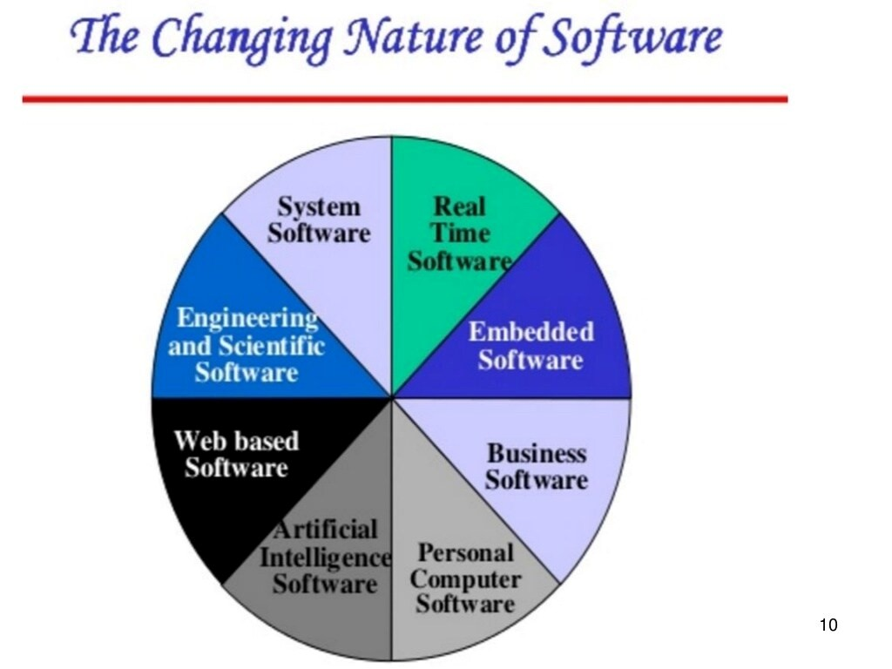

# Unit 1: Introduction to Software Engineering

[Chapter 1: Syllabus](./se-unit1)
[Chapter 1: JavaPoint Tutorial](https://www.javatpoint.com/software-engineering-tutorial)

## Why Software Engineering?

- So before explaining the subject, let's talk about why it's important.
- If you want to create any project or work on any project in a software company, you need to know this subject.
- You need to know the basic concepts means how you are going to the project.
- Here we are not talking about the coding part. But the way you are going to deliver the project.
- From starting to ending what are the criteria you need to follow.
- And what are the systemetical approach you need to follow.
- And what are the discipline you need to follow to create any product.

## Introduction to Software Engineering

- Before going into software engineering, let's talk about what is engineering.
- `Engineering` is the process of creating a product or service.
- `Engineering` is application of science, tools and methods to find cost effective solution to problems.
- `Software Engineering` is defined as systematic disciplined and quantifiable approach for the development, operation, and maintenance of software.
- `Software Engineering` is the process of designing, developing, testing, and deploying software.
- ### Characteristics of Software

  - `Software is developed or engineered`: it is not manufactured in the classical sense.
    
  - `Software does not wear out` However it deteriorates due to change.
    
  - `Software is custom built` rather than assembling existing components.
    - although the industry is moving towards component-based construction, software is still custom built.
      

- ### Failure curve for hardware and software

  

  

## Changing nature of software

- Seven broad categories of software are challenges for software engineers.
- These are:

  1. System software
  2. Application software
  3. Engineering and scientific software
  4. Embedded software
  5. Product line software
  6. Web application software
  7. Artificial intelligence software

  

1. `System software:`

- System software is a collection of programs written to service other programs.
- System software is a computer software designed to operate the computer hardware, to provide basic funtionality, and to provide a platform for running application software.
- Example: Linux, Windows operating system, etc.

2. `Application software:`

- An application is a task or a job a user wants to accomplish through a computer.
- Application software are programs that help a user perform a specific job.
- Example: Word, Excel, etc.

3. `Embedded software:`

- Embedded software is a software that is embedded in a device.
- Embedded software is a computer software designed to operate the computer hardware, to provide basic funtionality, and to provide a platform for running application software.
- Example: Linux, Windows operating system, etc.

4. `Artificial intelligence software:`

- **"Software that is capable of intelligent behaviour."** In creating intelligent software, this involves simulating a number of capabilities, including reasoning, learning, problem solving, perception, knowledge representation and decision making.
- Example: Flying drones, Chatbot, etc.

5. `Product line software:`

- A set of software-intensive system sharing a common, managed set of features that satisfies the specific needs of particular marked segment or mission and that are developed from a common set of core assets in a prescribed sequence.
- Example: Airline, Banking, etc.

6. `Engineering and scientific software:`

- Category of software used to facilitate the engineering functions and tasks.
  - characterised by "number crunching" algorithms.
- Example: Computer Aided Desing (CAD) software is a software that is used to create 3D models of mechanical, electrical, and other mechanical components.

7. `Web application software:`

- **Web based software** is a software that you use over the internet with a web browser.
- You don't need to install or download software on your computer or even worry about updating it.
- Example: Facebook, Gmail, etc.

8. `Real-time software:`

- **Real-time software** is a software that is designed to run in real time that monitors, analyzes, and controls real world events.
- Example: Video streaming, E-commerce, etc.
