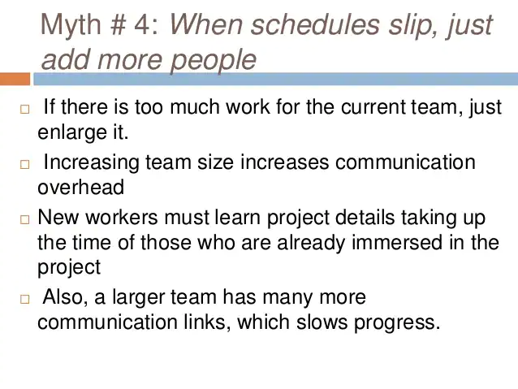
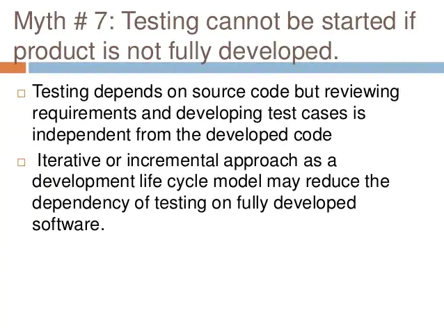
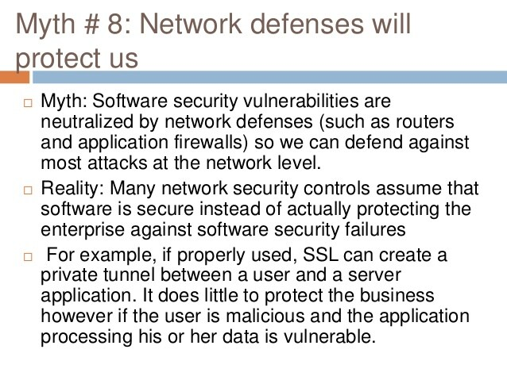

# Unit 1: Introduction to Software Engineering

[Chapter 1: Syllabus](./se-unit1)

[Chapter 1: JavaPoint Tutorial](https://www.javatpoint.com/software-engineering-tutorial)

## Why Software Engineering?

- So before explaining the subject, let's talk about why it's important.
- If you want to create any project or work on any project in a software company, you need to know this subject.
- You need to know the basic concepts means how you are going to the project.
- Here we are not talking about the coding part. But the way you are going to deliver the project.
- From starting to ending what are the criteria you need to follow.
- And what are the systematical approach you need to follow.
- And what are the discipline you need to follow to create any product.

---

## Introduction to Software Engineering

- Before going into software engineering, let's talk about what is engineering.
- `Engineering` is the process of creating a product or service.
- `Engineering` is application of science, tools and methods to find cost effective solution to problems.
- `Software Engineering` is defined as systematic disciplined and quantifiable approach for the development, operation, and maintenance of software.
- `Software Engineering` is the process of designing, developing, testing, and deploying software.

---

- ### Characteristics of Software

  
  
  

  - `Software is developed or engineered`: it is not manufactured in the classical sense.
  - `Software does not wear out` However it deteriorates due to change.
  - `Software is custom built` rather than assembling existing components.
    - although the industry is moving towards component-based construction, software is still custom built.

---

- ### Failure curve for hardware and software

  

  

## Changing nature of software

- Seven broad categories of software are challenges for software engineers.
- These are:

  1. System software
  2. Application software
  3. Engineering and scientific software
  4. Embedded software
  5. Product line software
  6. Web application software
  7. Artificial intelligence software

  

1. `System software:`

- System software is a collection of programs written to service other programs.
- System software is a computer software designed to operate the computer hardware, to provide basic functionality, and to provide a platform for running application software.
- Example: Linux, Windows operating system, etc.

2. `Application software:`

- An application is a task or a job a user wants to accomplish through a computer.
- Application software are programs that help a user perform a specific job.
- Example: Word, Excel, etc.

3. `Embedded software:`

- Embedded software is a software that is embedded in a device.
- Embedded software is a computer software designed to operate the computer hardware, to provide basic functionality, and to provide a platform for running application software.
- Example: Linux, Windows operating system, etc.

4. `Artificial intelligence software:`

- **"Software that is capable of intelligent behavior."** In creating intelligent software, this involves simulating a number of capabilities, including reasoning, learning, problem solving, perception, knowledge representation and decision making.
- Example: Flying drones, Chatbot, etc.

5. `Product line software:`

- A set of software-intensive system sharing a common, managed set of features that satisfies the specific needs of particular marked segment or mission and that are developed from a common set of core assets in a prescribed sequence.
- Example: Airline, Banking, etc.

6. `Engineering and scientific software:`

- Category of software used to facilitate the engineering functions and tasks.
  - characterized by "number crunching" algorithms.
- Example: Computer Aided Designing (CAD) software is a software that is used to create 3D models of mechanical, electrical, and other mechanical components.

7. `Web application software:`

- **Web based software** is a software that you use over the internet with a web browser.
- You don't need to install or download software on your computer or even worry about updating it.
- Example: Facebook, Gmail, etc.

8. `Real-time software:`

- **Real-time software** is a software that is designed to run in real time that monitors, analyzes, and controls real world events.
- Example: Video streaming, E-commerce, etc.

---

<h3> Software Evolution </h3>

- Software evolves due to changes.
- Changes occurs due to correction, adaption and enhancement.
- 8 Laws of unified theory
  - The law of continuing change.
  - the law of increasing complexity.
  - the law of self-regulation.
  - the law of conservation of organizational safety.
  - the law of conservation of familiarity.
  - the law of continuing growth.
  - the law of declining quality.
  - the feedback system law.

---

## Legacy Software

- The legacy software are older programs that were developed decades ago.
- The legacy software are not updated and not maintained.

  - quality of legacy software is poor.
  - inextensible design, convoluted code.
  - poor and non-existent documentation.
  - test cases and results that are not achieved.

  

  - ### Legacy software evolve due to following reasons:
    - The software must be adapted to meet the needs of new computing environment and technology.
    - the software must be enhanced to implement new business requirements.
    - the software must be extended to make it interoperable with more modern systems or database.
    - the software must be re-architected to meet the new requirements.

---

## Software development myths

`What is a myth?`:

- Myth means wrong belief or wrong information.
- Most, experienced experts have seen myths or superstitions (false beliefs or interpretations) misleading attitudes (naked users) which creates Major problems for management and technical people.F

- ### Why should we avoid myths?

  - Software myths propagated misinformation and confusion.
  - Software myths propagate false beliefs and confusion in the minds of management, users and developers.
  - Myths lead to false expectations and ultimately develop dissatisfaction among the users.

  
  
  
  
  
  
  
  
  
  
  

---

<h3> Types of software myths </h3>

- Management myths
- User(Customer) myths
- Developer(Practitioner) myths

---

<h3> 1. Management myths: </h3>

- Who are managers?:

  - Software managers often under pressure to maintain budgets, keep schedules from slipping, and improve quality.
  - misleading attitudes of managers, serious problems in software production.

  ***

  ### Myth 1

  We have all the standards and procedures available for software development i.e. the software developer has all the required.

  ### Fact:

  Software experts do not know that there are all of them levels. Such practices may or may not be expired at present / modern software engineering methods. And all existing processes are incomplete.

  ***

  ### Myth 2

  The addition of the latest hardware programs will improve the software development.

  ### Fact:

  The role of the latest hardware is not very high on standard software development; instead (CASE) Engineering tools help the computer they are more important than hardware to produce quality and productivity. Hence, the hardware resources are misused.

  ***

  ### Myth 3

  Managers think that, with the addition of more people and program planners to Software development can help meet project deadlines (If lagging behind).

  ### Fact:

  Software development is not, the process of doing things like production; here the addition of people in previous stages can reduce the time it will be used for productive development, as the newcomers would take time existing developers of definitions and understanding of the file project. However, planned additions are organized and organized It can help complete the project.

  ***

---

<h3> 2. User (Customer) myths:  </h3>

- The customer can be the direct users of the software, the technical team, marketing / sales department, or other company. Customer has myths.
- Leading to false expectations (customer) & that’s why you create dissatisfaction with the developer.

  ***

  ### Myth 1

  A general statement of intent is enough to start writing plans (software development) and details of objectives can be done over time.

  ### Fact:

  Official and detailed description of the database function, ethical performance, communication, structural issues and the verification process are important.
  It is happening that the complete communication between the customer and the developer is required.

  ***

  ### Myth 2

  Project requirements continue to change, but, change, can be easy location due to the flexible nature of the software.

  ### Fact:

  Changes were made to the final stages of software development but cost to make those changes grow through the latest stages of Development.
  A detailed analysis of user needs should be done to minimize change requirement. Figure shows the transition costs in
  Respect of the categories of development.

  ***

---

<h3> 3. Practitioner (Developer) Myths: </h3>

- The developer is the person who is responsible for the software development.

  ***

  ### Myth 1

  They believe that their work has been completed with the writing of the plan and they received it to work.

  ### Fact:

  It is true that every 60-80% effort goes into the maintenance phase (as of the latter software release). Efforts are required, where the product is available first delivered to customers.

  ***

  ### Myth 2

  There is no other way to achieve system quality, behind it done running.

  ### Fact:

  Systematic review of project technology is the quality of effective software verification method. These updates are quality filters and more accessible than test.

  ***

  ### Myth 3

  An operating system is the only product that can be successfully exported project.

  ### Fact:

  A working system is not enough, it is just the right document brochures and booklets are also required. To provide for guidance & software support.

  ***

  ### Myth 4

  Engineering software will enable us to build powerful and unnecessary document & always delay us.

  ### Fact:

  Software engineering does not deal with text building, rather while creating better quality leads to reduced recycling & this is being studied for rapid product delivery.

  ***

---

## Software engineering - A layered technology

<h3> 1. Quality Focus </h3>

The bedrock that supports software development is a quality focus.

- This includes Total Quality Management (TQM), Six Sigma, and other quality management systems.

---

<h3> 2. Process </h3>

The foundation of software engineering is the process layer.

- The software engineering process is the glue that holds the technology layers together and enables rational and timely development of computer software.
- The software process forms the basis for management control of software projects and establishes the context in which technical methods are applied, work products (models, documents, data, reports, forms, etc.) are produced, milestones are established, quality is ensured, and change is properly managed.

---

<h3> 3. Methods </h3>

Software engineering methods provide the technical how-to’s for building software.

- Methods encompass a broad array of tasks that include communication, requirements analysis, design modeling, program construction, testing, and support.
- Software engineering methods rely on a set of basic principles that govern each area of the technology and include modeling activities and other descriptive techniques.

---

<h3> 4. Tools </h3>

Software engineering tools provide automated or semi-automated support for the process and the methods.

- When tools are integrated so that information created by one tool can be used by another, a system for the support of software development, called `computer-aided software engineering`, is established.

---

## Process Framework

<h2> What is Process?</h2>

A process is defined as a collection of work activities, actions, and tasks that are performed when some work product is to be created. Each of these activities, actions, and tasks reside within a framework or model that defines their relationship with the process and with one another.

<h2> What is Process Framework?</h2>

A process framework establishes the foundation for a complete software engineering process by identifying a small number of framework activities that are applicable to all software projects, regardless of their size or complexity.

- the process framework encompasses a set of umbrella activities that are applicable across the entire software process.

---

<h2> A generic process framework for software engineering encompasses five activities: </h2>

---

<h3> 1. Communication: </h3>

- Before any technical work can commence, it is critically important to communicate and collaborate with the customer (and other stakeholders).
- The intent is to understand stakeholders’ objectives for the project and to gather requirements that help define software features and functions.

---

<h3> 2. Planning: </h3>

- Any complicated journey can be simplified if a map exists. A software project is a complicated journey, and the planning activity creates a `map` that helps guide the team as it makes the journey.
- The map—called a software project plan—defines the software engineering work by describing the technical tasks to be conducted, the risks that are likely, the resources that will be required, the work products to be produced, and a work schedule.

---

<h3> 3. Modeling: </h3>

- Whether you’re a landscaper, a bridge builder, an aeronautical engineer, a carpenter, or an architect, you work with models every day. You create a `sketch` of the thing so that you’ll understand the big picture—what it will look like architecturally, how the constituent parts fit together, and many other characteristics.
- If required, you refine the sketch into greater and greater detail in an effort to better understand the problem and how you’re going to solve it.
- A software engineer does the same thing by creating models to better understand software requirements and the design that will achieve those requirements.

---

<h3> 4. Construction: </h3>

- This activity combines code generation (either manual or automated) and the testing that is required to uncover errors in the code.

---

<h3> 5. Deployment: </h3>

- The software (as a complete entity or as a partially completed increment) is delivered to the customer who evaluates the delivered product and provides feedback based on the evaluation

---

<h2>Umbrella Activities</h2>

Software engineering process framework activities are complemented by a number of umbrella activities.

umbrella activities are applied throughout a software project and help a software team manage and control progress, quality,
change, and risk.

<h3>Typical umbrella activities include: </h3>

- `1. Software project tracking and control` allows the software team to assess progress against the project plan and take any necessary action to maintain the schedule.

- `2. Risk management` assesses risks that may affect the outcome of the project or the quality of the product. Software quality assurance—defines and conducts the activities required to ensure software quality.

- `3. Technical reviews` assesses software engineering work products in an effort
  to uncover and remove errors before they are propagated to the next activity.

- `4. Measurement` defines and collects process, project, and product measures that assist the team in delivering software that meets stakeholders’ needs; can be used in conjunction with all other framework and umbrella activities.

- `5. Software configuration management` manages the effects of change throughout the software process.

- `6. Reusability management` defines criteria for work product reuse (including software components) and establishes mechanisms to achieve reusable components.

- `7. Work product preparation and production` encompasses the activities required to create work products such as models, documents, logs, forms, and lists.

---

## Capability Maturity Model Integration - (CMMI)

- The Capability Maturity Model Integration (CMMI) is a model for creating and maintaining repeatable software, product, & service development processes.
- CMMI assists organizations in improving processes, mitigating risks, repeating projects, and encouraging a productive development culture. In a nutshell, CMMI provides a structured view of process improvement across an organization.
- CMMI was initially created by the Software Engineering Institute (SEI) at Carnegie Mellon University for use by the U.S. Department of Defense to assess the quality and capability of their software contractors.

<h3> CMMI Maturity Levels: </h3>

- Maturity levels are well-defined platforms or foundation layers that evolve over time and undergo continuous improvement process in order to get developed into mature software processes.
- Each maturity level is similar to a base of a pyramid which has some objectives, which when reached, strengthens it. Once the level of maturity framework is reached, a different component of the software process is established.
- This results in increased process capacity in the organization.
- Thus, a business can utilize CMMI to decrease costs, improve on-time delivery, improve productivity, improve product quality, improve service quality, improve customer satisfaction, gain impressive returns on investment, and so on.

  

  - `Maturity Level 1`: **Initial** (Ad-hoc Project Management)

    - Development tasks and projects are conducted on an ad-hoc basis with little or no documentation supporting the development process. Projects are viewed as unpredictable and reactive.

  - `Maturity Level 2`: **Managed** (Basic Project Management)

    - Development processes are documented sufficiently enough so that repeating the same steps may be attempted.
    - Projects are planned, executed, and managed at this level, but repeatability and sustainability is not yet achieved.

  - `Maturity Level 3`: **Defined** (Process Standardization)

    - Development processes are defined and established as a standard businesses process with some degree of process improvement occurring over time.
    - At this level, organizations are more proactive than reactive as standards and guidelines exist to provide direction across projects and programs. Organizations understand their shortcomings and how to address theses shortcomings.
    - Moreover, organizations know what their goals are for improvement.

  - `Maturity Level 4`: **Quantitatively Managed** (Quantitative Process Performance and Management)

    - Development processes are measured and controlled by quantitative data that includes metrics and indicators.
    - The organization utilizes this quantitative data to determine predictable processes.
    - Moreover, the organization uses data to effectively manage risks, make processes more efficient, and correct process deficiencies.

  - `Maturity Level 5`: **Optimizing** (Continuous Process Improvement)
    - Development processes at this level focus on continually improving process performance through both incremental and innovative technological change.
    - At this highest stage, an organization is in a constant state of improving and enhancing itself by utilizing statistical common causes of process variation.

---

## Process technology

  <h3> Process Flow Diagrams</h3>

---

## Product and Process

---

## Perspective Process Model

  <h3> Waterfall Model </h3>
  <h3> Incremental Model </h3>

## Evolutionary Process Model

  <h3> Prototype Model </h3>
  <h3> Spiral Model </h3>
  <h3> Concurrent Development Model </h3>
